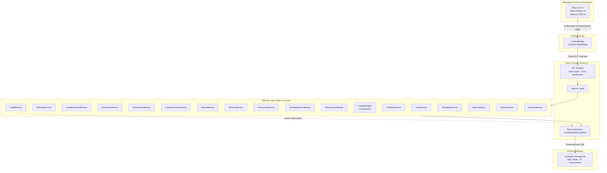
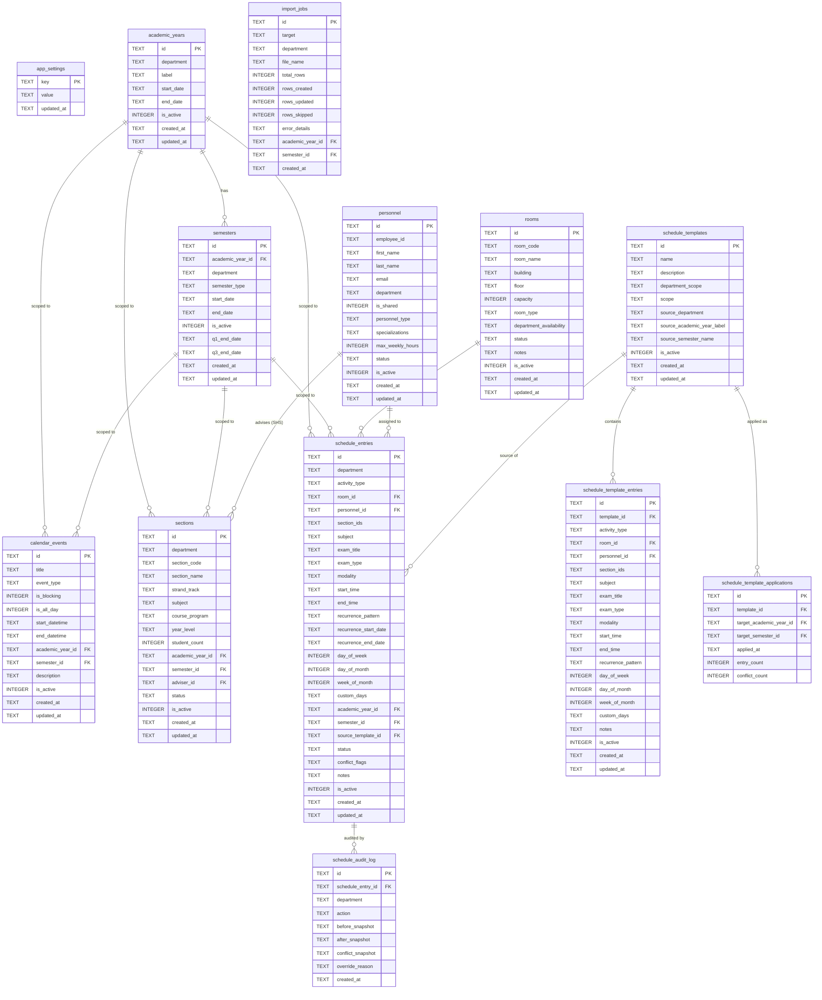

# Schedule Management System — System Architecture

> **Last Updated:** 2026-05-27
> **Last Reviewed:** 2026-05-27
> **Authors:** Developer
> **Version:** 1.0
> **Reflects SRS:** v1.0
> **References:** VibeLock System Guide · [SRS](SRS_ScheduleManagement_v1.0.md) *(source of truth for requirements)* · [ADRs](adr/) *(rationale for stack choices)*

---

## 1. High-Level Architecture

The system follows a two-process Electron architecture with strict process isolation. All business logic runs in the main process; the renderer is display-only.

**Key Architectural Invariants:**

1. **Renderer never accesses the database.** All data flows through IPC.
2. **All mutations are audited.** Audit records are written in the same transaction as the mutation.
3. **Soft delete is the default.** All entity deletions set `is_active = 0` rather than removing rows.
4. **Single writer.** better-sqlite3's synchronous API ensures atomic, serialized mutations.

---

## 2. Tech Stack

| Layer | Choice | Rationale / ADR |
|-------|--------|----------------|
| Desktop Framework | Electron | [ADR-001](adr/ADR-001_use-electron.md) — Chromium + Node.js, mature ecosystem, .exe packaging |
| Database | SQLite | [ADR-002](adr/ADR-002_use-sqlite-better-sqlite3.md) — Single-file, zero-config, ACID |
| Database Driver | better-sqlite3 | [ADR-002](adr/ADR-002_use-sqlite-better-sqlite3.md) — Synchronous API, native Backup API |
| UI Framework | React 18 | [ADR-003](adr/ADR-003_use-react-tailwind.md) — Component model, ecosystem |
| Styling | Tailwind CSS v3 | [ADR-003](adr/ADR-003_use-react-tailwind.md) — Utility-first, consistent design tokens |
| Bundler | Vite | [ADR-003](adr/ADR-003_use-react-tailwind.md) — Fast HMR for development |
| Routing | React Router v6 | Client-side routing within Electron renderer |
| Language | TypeScript | Type safety across main and renderer processes |
| Password Hashing | bcryptjs | Pure JS bcrypt implementation, cost factor 10 |
| UUID Generation | uuid (v4) | RFC 4122 compliant unique identifiers for all entities |
| Spreadsheet I/O | SheetJS (xlsx) | CSV/XLSX parsing for import, XLSX generation for export |
| PDF Generation | jspdf + jspdf-autotable | PDF export with table formatting |
| Packaging | electron-builder | Windows .exe installer generation |

---

## 3. Domain Model

> **Canonical source.** This section is the authoritative reference for the data model. The SRS Appendix B maintains a copy for self-containment — this document is authoritative in case of conflict.

### Entity Relationship Diagram

### Table Definitions

Full column definitions for all 14 tables are documented in [SRS Appendix B](SRS_ScheduleManagement_v1.0.md#appendix-b-data-dictionary). Key constraints:

| Table | Primary Key | Unique Constraints | Notable Constraints |
|-------|------------|-------------------|-------------------|
| app_settings | key (TEXT) | — | — |
| academic_years | id (UUID) | (department, label) | department CHECK IN ('SHS', 'COLLEGE') |
| semesters | id (UUID) | (academic_year_id, semester_type) | semester_type CHECK IN ('1ST_SEMESTER', '2ND_SEMESTER', 'SUMMER') |
| calendar_events | id (UUID) | — | event_type CHECK, is_blocking flag |
| rooms | id (UUID) | room_code | status CHECK IN ('AVAILABLE', 'MAINTENANCE', 'INACTIVE') |
| sections | id (UUID) | (department, section_code, academic_year_id, semester_id) | status CHECK IN ('ACTIVE', 'INACTIVE') |
| personnel | id (UUID) | employee_id, email | max_weekly_hours 1–80, specializations JSON array |
| schedule_entries | id (UUID) | — | status CHECK IN ('DRAFT', 'PUBLISHED'), conflict_flags JSON array |
| schedule_audit_log | id (UUID) | — | **Append-only** — no UPDATE or DELETE permitted (trigger-enforced) |
| schedule_templates | id (UUID) | name | department_scope CHECK, scope CHECK |
| schedule_template_entries | id (UUID) | — | FK → schedule_templates(id) |
| schedule_template_applications | id (UUID) | — | FK → schedule_templates(id), academic_years(id), semesters(id) |
| import_jobs | id (UUID) | — | target CHECK IN ('PERSONNEL', 'SECTIONS', 'ROOMS', 'CALENDAR_EVENTS') |

### SQLite PRAGMAs

| PRAGMA | Value | Purpose |
|--------|-------|---------|
| journal_mode | WAL | Write-Ahead Logging for durability and concurrent read during backup |
| foreign_keys | ON | Enforce foreign key constraints |
| busy_timeout | 5000 | Wait up to 5 seconds for locked database |
| synchronous | NORMAL | Balance between durability and write performance with WAL |
| cache_size | -64000 | 64 MB page cache |

---

## 4. Service Boundaries

The main process is organized into domain services. Each service owns its domain logic and database operations. Services communicate through direct function calls (not IPC — IPC is renderer-to-main only).

| Service | Responsibility | Dependencies |
|---------|---------------|-------------|
| **AuthService** | Login, password change, session state | SettingsService |
| **SettingsService** | App configuration CRUD, setup detection | — |
| **AcademicYearService** | AY CRUD, date validation, active toggle, label derivation | AuditService |
| **SemesterService** | Semester CRUD, quarter dates, type validation | AcademicYearService, AuditService |
| **ActiveTermService** | Resolve active AY + semester + quarter for a department | AcademicYearService, SemesterService |
| **CalendarEventService** | Calendar CRUD, blocking event cascade | ConflictEngine (cascade), AuditService |
| **RoomService** | Room CRUD, status cascade, delete protection | ConflictEngine (cascade), AuditService |
| **SectionService** | Section CRUD, dept-specific fields, delete protection | ConflictEngine (cascade), AuditService |
| **PersonnelService** | Personnel CRUD, weekly hours cascade, delete protection | ConflictEngine (cascade), AuditService |
| **ScheduleEntryService** | Entry CRUD, field dependency matrix, time validation | RecurrenceService, ConflictEngine, ActiveTermService, AuditService |
| **RecurrenceService** | Expand recurrence patterns to concrete date sets | — |
| **ConflictEngine** | Run 15 detectors against an entry, resource cascade | All entity services (read-only) |
| **PublishService** | Selective publish, unpublish, re-validate | ScheduleEntryService, ConflictEngine, AuditService |
| **AuditService** | Append-only audit log for all entity mutations | — |
| **TemplateService** | Save/apply templates, section remapping | ScheduleEntryService, ConflictEngine, AuditService |
| **ImportService** | CSV/XLSX parsing, validation, upsert | SheetJS, entity services (for FK validation), AuditService |
| **ExportService** | PDF/XLSX/CSV generation for 6 report types | jspdf, SheetJS, entity services (read-only) |
| **BackupService** | Manual backup, restore, auto-backup rotation | better-sqlite3 Backup API, AuthService (session invalidation) |

### Conflict Detectors (ConflictEngine sub-components)

| # | Detector | Code | Severity | Cross-Dept? |
|---|----------|------|----------|------------|
| 1 | Room Conflict | `room_conflict` | HARD | Yes |
| 2 | Personnel Conflict | `personnel_conflict` | HARD | Yes (shared) / No (non-shared) |
| 3 | Section Conflict | `section_conflict` | HARD | No (same dept+semester) |
| 4 | Blocked by Event | `blocked_by_event` | HARD | Yes |
| 5 | Personnel Overload | `personnel_overload` | HARD | Yes (global sum) |
| 6 | Capacity Exceeded | `capacity_exceeded` | SOFT | N/A (same entry) |
| 7 | Workload Approaching | `workload_approaching` | SOFT | Yes (global 80–100%) |
| 8 | Specialization Mismatch | `specialization_mismatch` | SOFT | N/A (same entry) |
| 9 | Room Unavailable | `room_unavailable` | HARD | N/A (room status) |
| 10 | Room Dept Mismatch | `room_dept_mismatch` | HARD | N/A (room vs entry dept) |
| 11 | Personnel Dept Mismatch | `personnel_dept_mismatch` | SOFT | N/A (personnel vs entry dept) |
| 12 | Exam Period Mismatch | `exam_period_mismatch` | SOFT | N/A (EXAM outside EXAM_PERIOD) |
| 13 | SHS Quarter Mismatch | `exam_quarter_mismatch` | SOFT | N/A (SHS only) |
| 14 | Personnel Inactive | `personnel_inactive` | HARD | N/A (personnel status) |
| 15 | Section Inactive | `section_inactive` | HARD | N/A (section status) |

---

## 5. API Surface

The system uses Electron IPC instead of HTTP. All channels are invoked via `ipcRenderer.invoke(channel, args)` from the renderer and handled by `ipcMain.handle(channel, handler)` in the main process.

Full IPC contract is documented in [SRS Appendix A](SRS_ScheduleManagement_v1.0.md#appendix-a-ipc-contract-reference). Summary of channel groups:

| Domain | Channels | Auth Required |
|--------|----------|--------------|
| Auth & Setup | `auth:check-setup`, `auth:login`, `auth:change-password`, `setup:complete` | No (except change-password) |
| Academic Terms | `academic-years:list/create/get/update/get-semesters`, `semesters:create/update`, `active-term:get` | Yes |
| Calendar Events | `calendar-events:list/create/get/update/delete` | Yes |
| Rooms | `rooms:list/create/get/update/delete/get-schedule` | Yes |
| Sections | `sections:list/create/get/update/delete/get-schedule` | Yes |
| Personnel | `personnel:list/create/get/update/delete/get-schedule` | Yes |
| Schedules | `schedules:list-draft/create-draft/update-draft/delete-draft/validate/publish/unpublish/list-exam` | Yes |
| Templates | `templates:list/create/get/update/delete/get-entries/update-entry/delete-entry/apply/get-applications` | Yes |
| Imports | `imports:download-template/upload/commit/list-jobs/get-job` | Yes |
| Exports | `exports:schedule/calendar/personnel-load/room-utilization/section-schedule/exam-schedule` | Yes |
| Backup | `backup:create/restore/list-auto/restore-auto/delete-auto` | Yes |
| Settings | `settings:get/get-all/update` | Yes |
| Dialogs | `dialog:open-file/save-file` | Yes |

**Response Envelope:** All channels return `{ data: T | null, error: { code, message, details? } | null }`.

---

## 6. Caching Strategy

N/A — Single-user desktop application with local SQLite database. All queries execute against the local database file with a 64MB page cache (PRAGMA cache_size). No application-level caching layer is needed.

---

## 7. Security Design

| Concern | Mitigation |
|---------|-----------|
| Process isolation | `contextIsolation: true`, `nodeIntegration: false`, `sandbox: true` (ADR-004) |
| IPC channel exposure | Explicit channel whitelisting via `contextBridge.exposeInMainWorld()` — only declared channels are callable from renderer |
| Authentication | bcryptjs hash (cost 10) stored in `app_settings`. In-memory `isAuthenticated` flag. No token/session persistence. |
| Auth enforcement | IPC registry middleware checks `isAuthenticated` before all handlers except `auth:check-setup`, `auth:login`, `setup:complete` |
| SQL injection | All queries use parameterized statements (`?` placeholders). No string concatenation in SQL. |
| Error leakage | Raw errors sanitized in IPC layer. Renderer receives structured `{ code, message }` only. Stack traces never exposed. |
| Audit integrity | `schedule_audit_log` table has a trigger blocking UPDATE and DELETE. Append-only by design. |
| Data integrity | Foreign keys enforced at DB level (`PRAGMA foreign_keys = ON`). All mutations wrapped in transactions. |
| Brute-force login | Not mitigated — accepted as proportional to offline single-user threat model (no network attack surface) |

---

## 8. Resolved Design Questions

| # | Question | Decision | Reference |
|---|----------|----------|-----------|
| 1 | Why Electron over native desktop? | Web tech reuse, mature packaging, strong security model | [ADR-001](adr/ADR-001_use-electron.md) |
| 2 | Why synchronous DB over async? | Simpler transaction logic, atomic audit coupling | [ADR-002](adr/ADR-002_use-sqlite-better-sqlite3.md) |
| 3 | Why React over Vue/Svelte? | Team familiarity, ecosystem for complex forms/grids | [ADR-003](adr/ADR-003_use-react-tailwind.md) |
| 4 | Why all logic in main process? | Security (contextIsolation), single writer, testability | [ADR-004](adr/ADR-004_ipc-main-process-architecture.md) |
| 5 | Why soft delete over hard delete? | Preserves referential integrity for audit history | SRS NFR-D-004, System Constraint 23 |
| 6 | Why WAL mode? | Safe concurrent reads during backup, better write performance | SRS Appendix B.14 |
| 7 | Why offset-based pagination? | Simple, predictable for UI (not cursor-based) | Sufficient for < 10K record datasets |
| 8 | Why 15 conflict detectors as pipeline? | Pluggable architecture, each detector is isolated and testable | SRS FR-10, modular design |
| 9 | Why non-atomic publish? | Individual entry success/failure gives admin control | SRS FR-11, audit SQ-03 |

---

## 9. Environments & Deployment *(Optional)*

N/A — The Schedule Management System is a local-only desktop application distributed as a Windows `.exe` installer via `electron-builder`. There are no server environments, CI/CD pipelines, or scaling considerations.

**Distribution:** Single `.exe` installer, installed directly on institutional Windows machines. No auto-update mechanism in V1.

---

## 10. Platform-Specific Architecture *(Optional)*

N/A — Single platform (Windows desktop). No multi-platform considerations.

---

> **Document Rules:**
> - This is a living document. Update it when the architecture changes.
> - Keep diagrams current — stale diagrams are worse than no diagrams.
> - For rationale behind individual tech choices, write an ADR and link to it from the Tech Stack table.

---

## Change History

*Track all revisions to this document. Never delete entries — the history is the audit trail.*

| Date | Author | Changes | Related CR/ADR |
|------|--------|---------|----------------|
| 2026-05-27 | Developer | Initial draft | ADR-001, ADR-002, ADR-003, ADR-004 |
